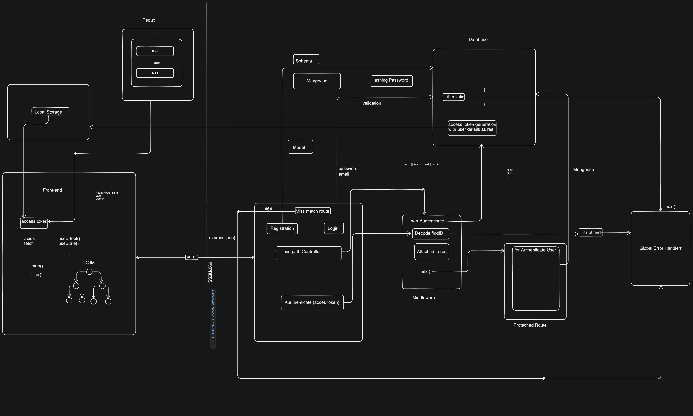

"# Full-Stack-Flow-Chart" 
🔐 Full-Stack Authentication Flow System

👌😊SCAN for the Clear Flow Diagram!🙌😍

This is a complete **Full-Stack Authentication Flow** system built with **React**, **Redux**, **Node.js**, **Express**, **MongoDB**, and **JWT**. It includes user authentication, protected routes, token handling, global error management, and an integrated front-end and back-end architecture.

> 🖼️ **Note**: This project includes an image diagram that visually represents the entire flow of all the keywords and components described below—from front-end to back-end. It is highly recommended to refer to the diagram for a better understanding of the architecture and data flow.

---

## 📌 Key Features

- 🔐 User registration & login with hashed passwords
- 🪪 JWT-based token generation & verification
- 🔒 Protected API routes using middleware
- 🧠 Redux for global state management
- 🌐 RESTful APIs with Express & Mongoose
- 🧱 React Router DOM for protected navigation
- 💾 Token persistence using localStorage
- 🧹 Centralized global error handler

---

## ⚙️ Technologies Used

### 🧑‍💻 Frontend
- React
- Redux Toolkit
- React Router DOM
- Axios

### 🛠️ Backend
- Node.js
- Express.js
- MongoDB
- Mongoose
- Bcryptjs
- JSON Web Token (JWT)
- dotenv

---

## 📊 Flow Diagram

The architecture of this project is illustrated in the included **flow diagram image**, which covers:

- LocalStorage and token management
- Component-based rendering (DOM, useEffect, useState)
- Authentication middleware
- Express route controllers and validation
- MongoDB model schemas and Mongoose
- Error handling using Express middleware

This image helps you **visualize the complete full-stack authentication lifecycle**.

---

## 🧾 Project Structure

fullstack-auth-flow/
├── client/ # React front-end
│ ├── redux/ # Redux slices & store
│ ├── components/ # Reusable components
│ └── pages/ # Login, Register, Dashboard etc.
│
├── server/ # Express back-end
│ ├── controllers/ # Route logic
│ ├── middleware/ # Authentication, error handling
│ ├── models/ # Mongoose user schema
│ ├── routes/ # API route handlers
│ └── server.js # Entry point
│
├── README.md # Project documentation (this file)
└── auth-flow-diagram.png # Flow diagram representing full-stack logic

yaml
Copy
Edit

---

## 🚀 Getting Started

### Clone the Repository

```bash
git clone https://github.com/yourusername/fullstack-auth-flow.git
cd fullstack-auth-flow
Set Up the Server
bash
Copy
Edit
cd server
npm install
npm run dev
Set Up the Client
bash
Copy
Edit
cd ../client
npm install
npm start
🔐 Authentication Flow Summary
Register/Login on the frontend.

Backend validates credentials & returns a JWT.

JWT is saved in localStorage.

Protected routes require JWT in request headers.

Middleware verifies the token and grants access.

Errors are caught by the global error handler.

📄 License
This project is licensed under the MIT License.

👨‍💻 Author
Name: Your Name

GitHub: @yourusername

Email: youremail@example.com

yaml
Copy
Edit
